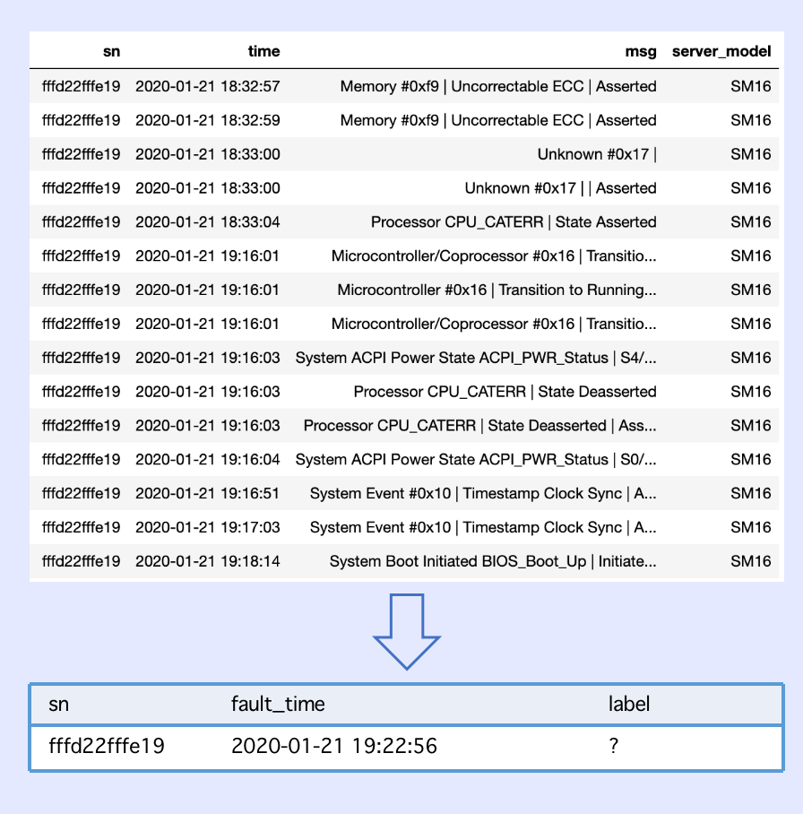
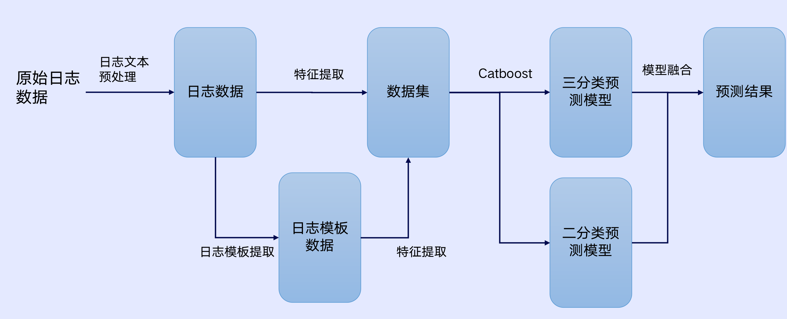
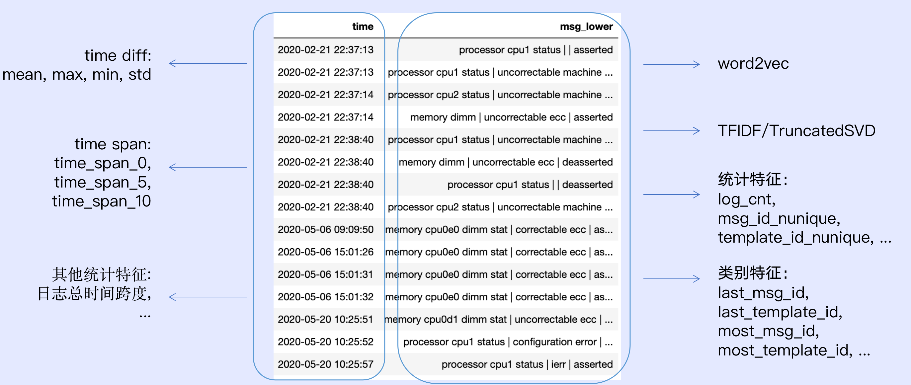
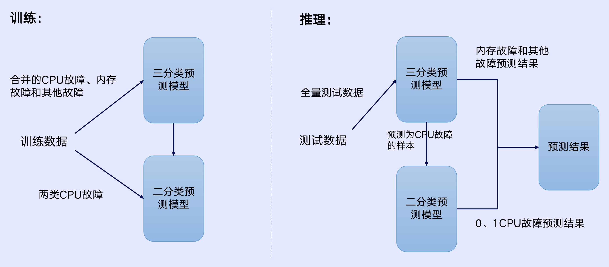

# 第三届阿里云磐久智维算法大赛 - 基于大规模日志的故障诊断

## 赛题介绍

### 比赛链接

https://tianchi.aliyun.com/competition/entrance/531947/introduction

### 问题描述

给定一段时间的服务器系统日志数据，从数据中挖掘出和各类故障相关的特征，采用合适的机器学习算法诊断服务器的故障类型。

+ 故障类型：0类和1类表示CPU相关故障，2类表示内存相关故障，3类表示其他类型故障
+ 日志数据：包含系统日志时间、日志文本、服务器型号
+ 复赛补充数据：crashdump日志数据和venus日志数据

## 方案介绍

### 数据预处理

+ 日志文本预处理：对log文本数据进行预处理，合并文本中的地址、阈值、编号信息

+ 日志模板提取：所有日志文本排序后使用Drain3进行预处理日志文本的模板提取，得到日志文本对应的template_id

数据预处理具体内容见`code/preprocess.py`

### 特征工程

特征工程具体内容见`code/feature.py`

### 模型训练

模型训练具体内容见`code/main.py`

### 提升的主要来源

1. 多角度深挖特征，基于特征表现、特征重要性和业务知识循环迭代，构建了有效的特征集；

2. 较多使用类别特征，利用Catboost模型对类别特征的特殊处理方式，有效减少过拟合；

3. 分阶段的模型训练和预测，提高模型对CPU故障两类故障的预测能力。